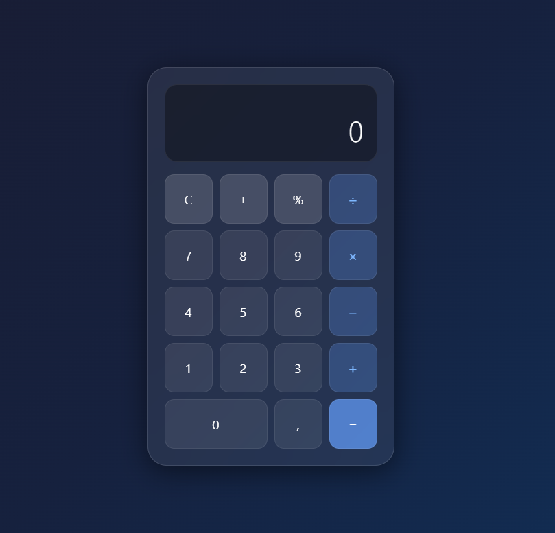

# 🧮 Calculadora v1

Calculadora com interface Glassmorphism desenvolvida em Python e JavaScript.

## ✨ Funcionalidades

- Operações básicas: soma, subtração, multiplicação e divisão
- Respeita a ordem correta das operações matemáticas
- Interface Glassmorphism com fundo gradiente
- Suporte a números decimais, porcentagem e troca de sinal

## 🛠️ Tecnologias

- Python
- Streamlit
- HTML + CSS + JavaScript

## 🚀 Como rodar o projeto

**Interface HTML** (recomendado):
```bash
# Clone o repositório
git clone https://github.com/charllesrick/calculadora_v1.git

# Abra o arquivo diretamente no navegador
start calculadora.html
```

**Interface Streamlit**:
```bash
# Instale as dependências
pip install -r requirements.txt

# Rode o projeto
streamlit run app.py
```

## 📸 Preview

